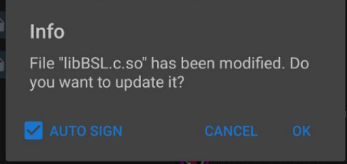
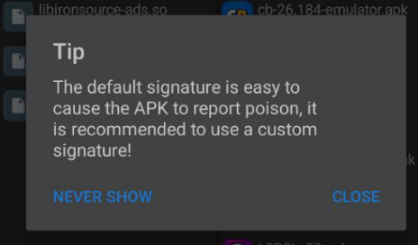

# BSL-V53
Python Brawl Stars server emulator for version 53.176

## Important Read
Writing on behalf of the Author [here](https://github.com/LkPrtctrd/)

Method works on Windows 10, Windows 11, Ubuntu, Linux, and all Linux distributions

### Server ###

[I](https://github.com/LkPrtctrd) use a server in zip format from BSDS, which [I](https://github.com/LkPrtctrd) modified, and which was created by [Сrazor](https://github.com/CrazorTheCat) and [risporse](https://github.com/risporce).

1: [Download the server](https://github.com/LkPrtctrd/BSL-V53/archive/refs/heads/master.zip) and extract it.

2: Open cmd on your computer and navigate to the server folder.

3: Install TweetnaclCrypto, if you don't have it (navigate to the server folder -> Heart -> Crypto and enter `python setup.py install --user`).

4: Install Heart by typing the command in cmd `pip3 install Heart`

5: Enter `python3 Main.py` and the server is running.

### Android Client ###
1: [Download APK here](https://www.mediafire.com/file/n7gptweb86ncf5a/com.bsl.v53-rev1.apk/file).

2: Download `MT Manager`: [here](https://fs273.tbx.su/files10/1909358_304493/mt2.14.5.apk)

3: Change the APK file name `com.bsl.v53-rev1.apk` to `com.bsl.v53-rev1.zip`. Video explanation: [here](https://github.com/for0si0zero/BSL-V53/main/2.mp4)

4: Open `com.bsl.v53-rev1.zip`.

5: Open the `lib` folder, then open the `armeabi-v7a` folder.

6: Open the file `libBSL.c.so` using a Text Editor.

7: Change `redirectHost` to your IP address (How to find?: Click) (and `redirectPort`, if needed) in the configuration. It's important to make these changes in the `MT Manager` program!!!

8: Save the file by clicking 

9: Go back, and you'll see a dialog box  first click on the square next to the AUTO SIGN, then click OK. and Wait.

10: If you see a prompt  click Close, and go back to the `com.bsl.v53-rev1.zip` file.

11: Change the APK file name `com.bsl.v53-rev1.zip` to `com.bsl.v53-rev1.apk` (Video explanation was in step 3).

12: Install `com.bsl.v53-rev1.apk`.

13: Enjoy playing BSL-V53!

## How to find your IP address? ##
To find your IP address on Windows systems, open cmd and type `ipconfig`, then copy the numbers from the `IPv4 Address` line.

To find your IP address on Ubuntu, Linux, and all Linux distributions, open the console and type `ip a`, then copy the IP from the `inet` line.

## Screenshots ##

## Information ##
Wrote an article on https://github.com/for0si0zero (me).
If there were any errors, please write to the Discord channel https://discord.gg/q6KAjSBtvw.