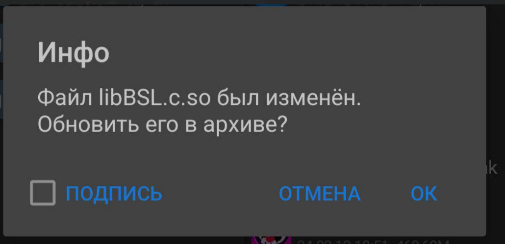
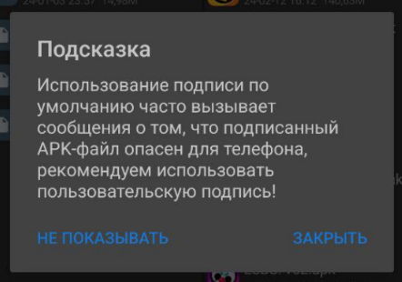

# BSL-V53
Python Brawl Stars сервер эмулятор для версии 53.176

## Важно Прочитай
Пишу от лица Автора https://github.com/LkPrtctrd/

Метод работает на Windows 10, Windows 11, Ubuntu, Linux, и все линуксы

### Сервер ###

[Я](https://github.com/LkPrtctrd) использую сервер в формате zip от BSDS, который [я](https://github.com/LkPrtctrd) модифицировал, и который был создан [Сrazor](https://github.com/CrazorTheCat) и [risporse](https://github.com/risporce).

1: [Скачайте сервер](https://github.com/LkPrtctrd/BSL-V53/archive/refs/heads/master.zip) и распакуйте его.

2: Откройте cmd на вашем компьютере и перейдите в папку сервера.

3: Установите TweetnaclCrypto, если у вас его нет (перейдите в папку сервера -> Heart -> Crypto и введите `python setup.py install --user`).

4: Установите Heart, написав команду в cmd `pip3 install Heart`

5: Введите `python3 Main.py` и сервер запущен.

### Android Клиент ###
1: [Скачайте APK здесь](https://www.mediafire.com/file/n7gptweb86ncf5a/com.bsl.v53-rev1.apk/file).

2: Скачайте `MT Manager`: [тык](https://fs273.tbx.su/files10/1909358_304493/mt2.14.5.apk)

3: Измените Название апк файла `com.bsl.v53-rev1.apk` на `com.bsl.v53-rev1.zip`. Видео объяснение: [тык](https://raw.githubusercontent.com/for0si0zero/BSL-V53/main/1.mp4)

4: Откройте `com.bsl.v53-rev1.zip`.

5: Откройте папку `lib`, а дальше откройте папку `armeabi-v7a`.

6: Откройте файл `libBSL.c.so` используя Тексовой Редактор

7: Измените `redirectHost` На ваш ип адресс (Как узнать?: Тык) (и `redirectPort`, если вам это нужно) в конфигурации. Важно то что вы должны изменять это в програме `MT Manager`!!!

8: Сохраните файл нажав на 

9: Вернитесь, и у вас появеться такая табличка  нажмите сначало на квадрат возле подпись, а потом нажмите на ок. Подождите. 

10: Если у вас высветелась табличка Подсказка () то нажмите на Закрыть, и вернитесь к файлу `com.bsl.v53-rev1.zip`

11: Измените Название апк файла `com.bsl.v53-rev1.zip` на `com.bsl.v53-rev1.apk`(Видео объяснение было в 3 пункте).

12: Установите `com.bsl.v53-rev1.apk`.

13: Наслаждайтесь игрой в BSL-V53!

## Как узнать ваш ип адрес? ##
Чтобы Узнать ваш ип адрес на системах Windows Откройте cmd и напишите там `ipconfig`, и скопируйте цыфры из строчки `IPv4 Address`.

Чтобы Узнать ваш ип адресс на системах Ubuntu, Linux, и все линуксы Откройте консоль и напишите `ip a`, и скопируйте ип с строчки `inet`.

## Скриншоты ##

## Информация ##
Написал статью https://github.com/for0si0zero (я)
Если у вас были ошибки пишите в дискорд канал https://discord.gg/q6KAjSBtvwы